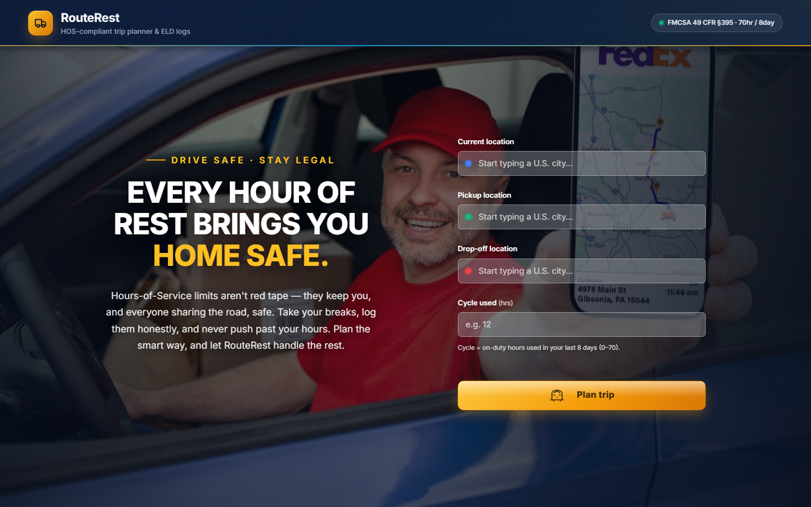
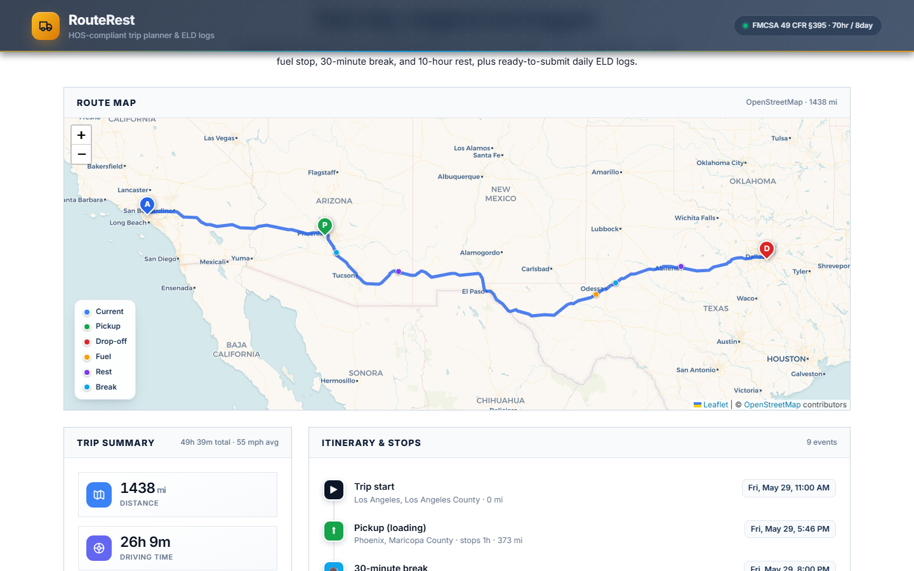
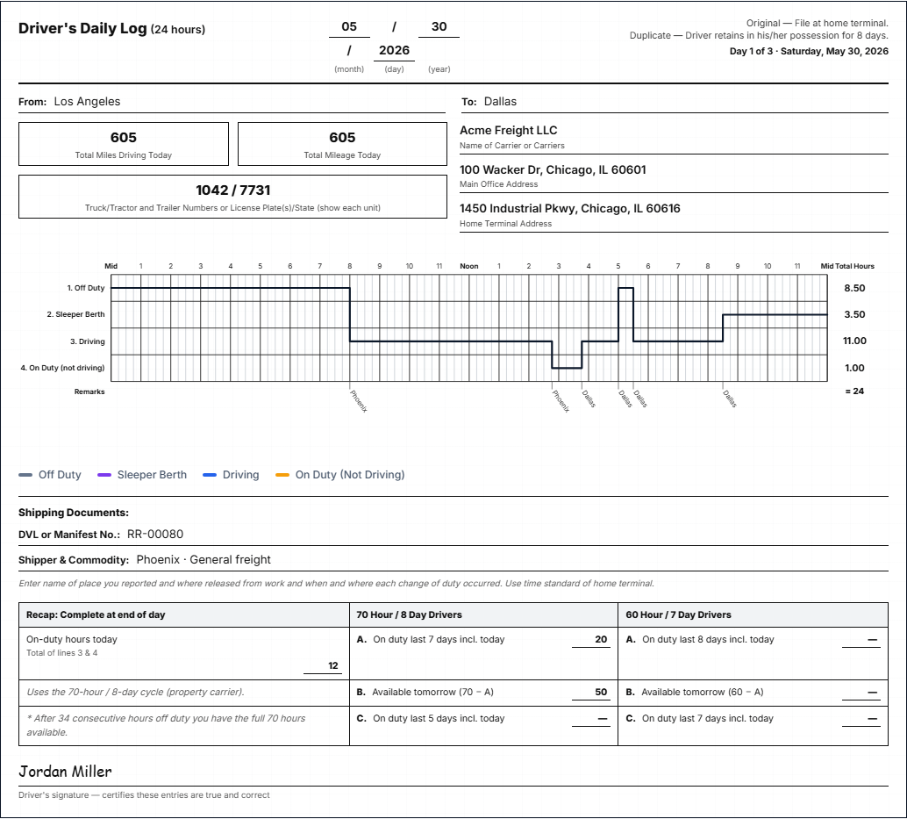

# 🚛 RouteRest — HOS-Compliant Trip Planner & ELD Log Generator

RouteRest helps U.S. truck drivers plan a trip that stays within the federal
**Hours-of-Service (HOS)** rules. You enter where you are, where to pick up and
drop off, and how many cycle hours you've already used — and RouteRest returns:

- an **interactive route map** with every required stop (fuel, breaks, rests), and
- **filled-out daily ELD log sheets**, one per day, in the official FMCSA format.

| | |
|---|---|
| **Live app** | https://route-rest.vercel.app/ |

---

## 📸 Screenshots

**Plan a trip**



**Route map, trip summary & itinerary**



**Auto-generated daily ELD log sheet**



---

## ✨ What it does

- **Four simple inputs** — current location, pickup, drop-off, and current cycle
  hours used.
- **U.S. city autocomplete** — start typing and pick a location; no need to type
  full addresses.
- **Route map** — the full driving route with colored markers for the start,
  pickup, and drop-off, plus smaller markers for fuel stops, breaks, and rests.
- **Turn-by-turn directions** — plain-English driving instructions for each leg
  ("Merge onto I-10 E", "Take the ramp…") with per-step mileage.
- **Trip summary** — total distance, driving time, on-duty time, number of log
  days, fuel stops, rests, and the cycle hours used at the end of the trip.
- **Itinerary** — every stop with arrival time and trip mileage.
- **Daily ELD log sheets** — drawn in the official *Driver's Daily Log* grid
  format, one per calendar day, with the carrier, equipment, shipping, remarks
  and end-of-day recap fields filled in. Longer trips automatically produce
  multiple sheets.
- **Download as PDF** — export the daily logs to a clean, printable PDF.

---

## 🧭 How the plan stays compliant

RouteRest assumes a **property-carrying driver on the 70-hour / 8-day cycle** (no
adverse driving conditions) and automatically schedules the trip around these
federal limits:

| Rule | What RouteRest does |
|------|---------------------|
| **11-hour driving limit** | Caps driving at 11 hours per shift, then schedules a 10-hour rest. |
| **14-hour on-duty window** | Stops driving once 14 hours have passed since the shift began. |
| **30-minute break** | Inserts a break after 8 cumulative hours of driving. |
| **70-hour / 8-day cycle** | Tracks the running cycle starting from the hours you enter. |
| **34-hour restart** | Adds a 34-hour restart automatically when the cycle is exhausted. |
| **Fueling** | Schedules a fuel stop at least every 1,000 miles. |
| **Pickup & drop-off** | Allows 1 hour of on-duty time for each. |

Driving time is based on an average speed of **55 mph**, and each daily log
sheet always totals a full 24 hours.

---

## 🗺️ Built with

- **Backend** — Django + Django REST Framework (the Hours-of-Service planning
  engine)
- **Frontend** — React
- **Maps & data** — OpenStreetMap, with routing by OSRM and geocoding by
  Nominatim (all free, no API keys)

---

## ▶️ Running it locally (optional)

Two terminals:

```bash
# 1) Backend  (http://127.0.0.1:8000)
cd backend
python -m venv venv
venv\Scripts\activate        # Windows  ·  source venv/bin/activate on macOS/Linux
pip install -r requirements.txt
python manage.py migrate
python manage.py runserver

# 2) Frontend  (http://127.0.0.1:5173)
cd frontend
npm install
npm run dev
```

Then open **http://127.0.0.1:5173** and plan a trip.

---

_RouteRest is a planning aid and demonstration, not legal HOS advice._
